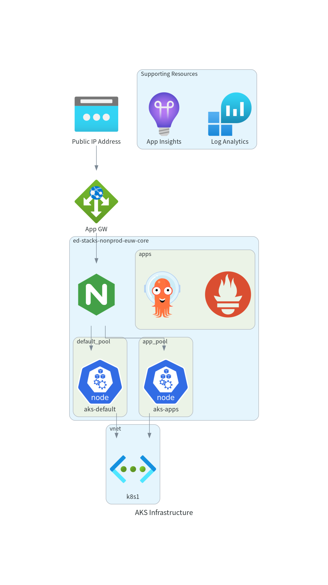

== Infrastructure

All of the infrastructure that is deployed to Azure, is done using Terraform. The templates have been configured so that different options can be deployed depending on requirements.

=== Architecture Overview

The Terraform stack combines Ensono Stacks modules with local modules and data sources. The diagram below shows the module relationships.

[graphviz]
----
include::diagrams/module-dependencies.dot[]
----

The following diagram depicts the resources that are deployed.

.Azure Resources

NOTE: The diagram shown is generated from a prototype diagram as configuration so may not be 100% accurate yet.

The deployment of the resources is performed using the Ensono Digital AKS module as found in the https://github.com/amido/stacks-terraform[Stacks Terraform] repository.

=== Terraform Outputs

A number of outputs from Terraform are required in other parts of the pipeline, for example when deploying Helm charts to the cluster.

A new PowerShell cmdlet has been created called `Set-EnvironmentVars` which allows any JSON string to be passed and for it to be interpreted and the name and value to be turned into environment variables. The option to pass the date through is also available so that a simple key value pair is passed along the pipeline.

The following code snippet shows how the outputs from Terraform can be turned into prefixed environment variables.

.Extracting Terraform outputs
[source,powershell,linenums]
----
# This command is run from the root of the repository
Invoke-Terraform -Output -Path deploy/terraform | `
    Set-EnvironmentVars -prefix "TFOUT" -key "value" -passthru | `
    ConvertTo-Yaml | `
    Out-File -Path inspec_inputs.yml
----

As can be seen from the example above, this command has four parts to the pipeline.

. Get the outputs from Terraform as a JSON string.
* Under the hood the `Invoke-Terraform` calls the Terraform command and retrieves the output as JSON
. Create environment variables from each of the names of the outputs in the JSON. Prefix these names with `TFOUT`. As the data from Terraform can be nested, the `-key` parameter informs the cmdlet which nested parameter holds the value. Also pass an array of data through the pipeline.
. Convert the array to a YAML string
. Write the the YAML string to a file to be used for the infrastructure tests

=== Outputs Reference

Key outputs used across the pipeline include:

* `resource_group_name`
* `aks_cluster_name`
* `aks_ingress_public_ip`
* `app_gateway_public_ip_name`
* `dns_base_domain`

=== Data Sources and Azure API Dependencies

Data sources are used to fetch resource IDs, DNS zones, and version information. Ensure the service principal has read permissions in the relevant resource groups and subscriptions.

=== Workspace Strategy

Terraform workspaces are aligned with environment names. The workspace is selected or created during `infra:init` using the `TF_VAR_stage` value.
